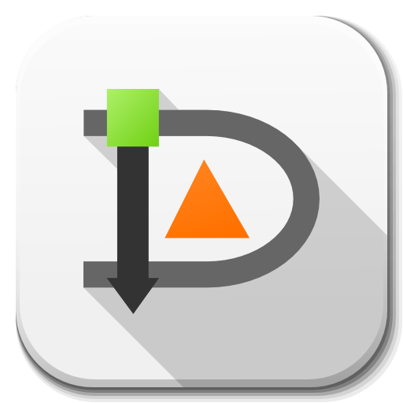
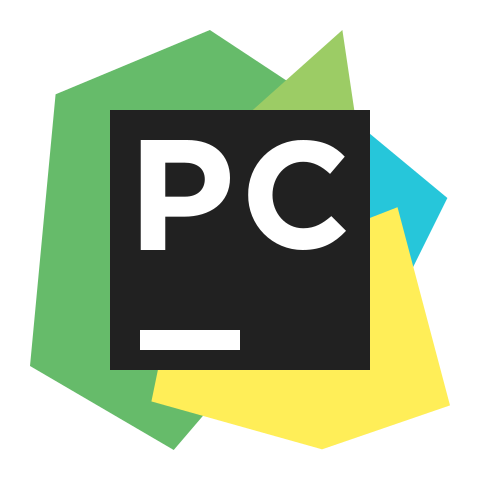

<h1 align="center">Bienvenido a mi Github</h1>

  

Soy <b>desarrollador web</b>, con experiencia en la creación, desarrollo y mantenimiento de aplicaciones utilizando tecnologías como <b>C#, PHP, Java, JavaScript, CSS, HTML, SQL, y frameworks como Angular, Blazor, Symfony y Bootstrap.</b>

Además, he trabajado en atención al cliente y soporte técnico, lo que ha fortalecido mis habilidades en resolución de problemas, comunicación eficaz y liderazgo, ya que fui responsable de la formación de nuevo personal.

Mis competencias incluyen autogestión, adaptabilidad, manejo del estrés y trabajo en equipo, además de un fuerte pensamiento crítico y lógico. Busco oportunidades para seguir desarrollándome como desarrollador web y aportar con mi proactividad, ética profesional y enfoque en la atención al detalle.

        
    
  
  
  

<h2 align="left">Back-end</h2>

   &nbsp;
   &nbsp;
   &nbsp;
   &nbsp;
   &nbsp;
   &nbsp;
   &nbsp;
   &nbsp;
  

<h2 align="left">Front-end</h2>

   &nbsp;
   &nbsp;
   &nbsp;
   &nbsp;
   &nbsp;
   &nbsp;
   &nbsp;
   &nbsp;
  &nbsp;
    &nbsp;
    &nbsp;
    &nbsp;
    &nbsp;
    

<h2 align="left">Bases de datos</h2>

   &nbsp;
   &nbsp;
   &nbsp;
   &nbsp;
   &nbsp;

<h2 align="left">Servidores</h2>

   &nbsp;
   &nbsp;
   &nbsp;
   &nbsp;
   &nbsp;

<h2 align="left">Herramientas</h2>

   &nbsp;
   &nbsp;
   &nbsp;
   &nbsp;
   &nbsp;
   &nbsp;
   &nbsp;
   &nbsp;
   &nbsp;
   &nbsp;
   &nbsp;
   &nbsp;
   &nbsp;
   &nbsp;
   &nbsp;
     &nbsp;
     &nbsp;
     &nbsp;
     &nbsp;
     &nbsp;
     &nbsp;
     &nbsp;
     &nbsp;
     &nbsp;
     &nbsp;
     &nbsp;
     &nbsp;
     &nbsp;
     &nbsp;
     &nbsp;
     &nbsp;
     &nbsp;

